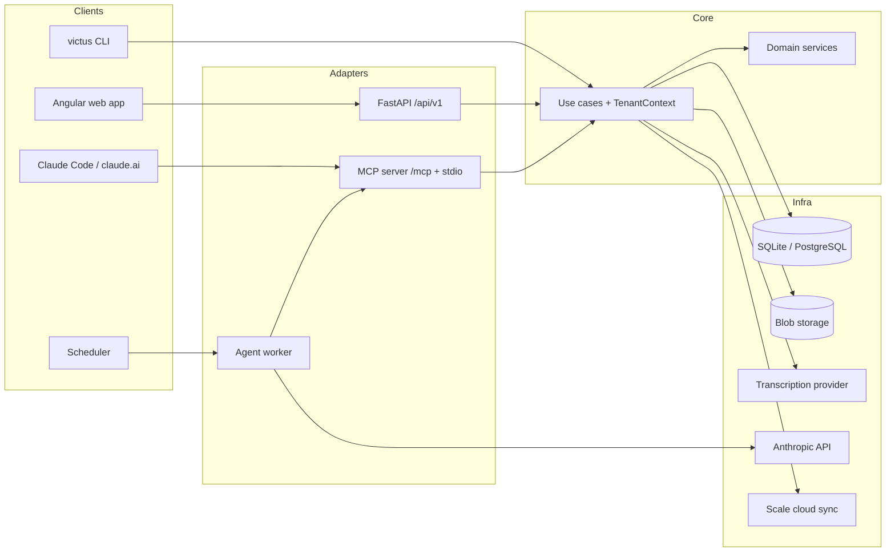
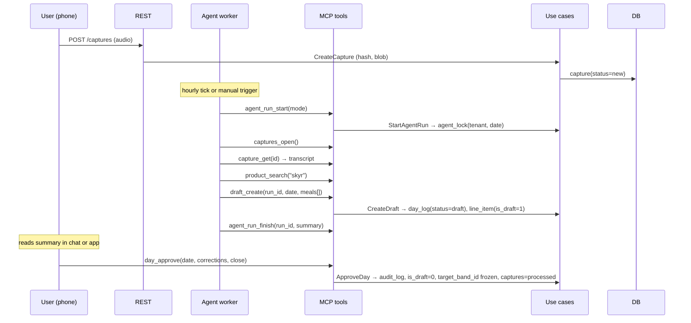
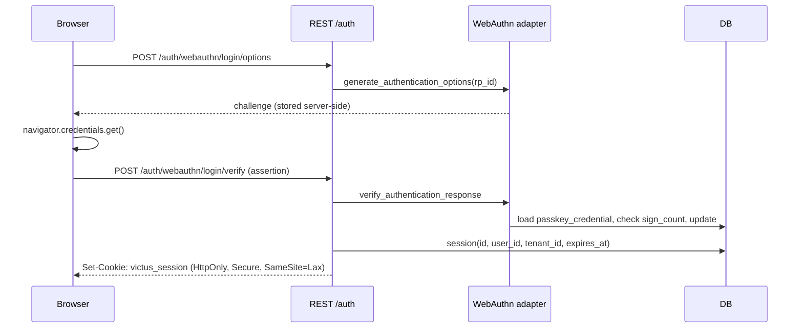

# Architecture

Victus is a hexagonal (ports-and-adapters) application. The domain knows nothing about databases, HTTP or LLMs; the
application layer orchestrates use cases inside one transaction each; adapters plug in at the edges. Four *primary*
adapters (REST, MCP, CLI, agent worker) share the same use cases and therefore the same authorisation.

## Layers

| Layer | Package | Contains | Rules |
|---|---|---|---|
| **Domain** | `src/victus/domain/` | Entities, value objects (`Macros`, `Quantity`, `Period`, `Confidence`, `Grade`), domain services as pure functions (`nutrition`, `band_rating`, `tdee`, `trend`, `forecast`, `burndown`, `reliability`, `consistency`, `matching`, `quantity_parser`, `target_band`) | No SQLAlchemy, no Pydantic, no file or network I/O. `datetime` only as a parameter. |
| **Application** | `src/victus/application/` | One use case per business action (`execute(cmd) -> dto`), ports as `typing.Protocol`, `UnitOfWork`, `TenantContext`, DTOs | Depends only on the domain and its own ports. One use-case execution = one transaction. |
| **Infrastructure** | `src/victus/infrastructure/` | SQLAlchemy ORM and repositories, Alembic migrations, blob storage, transcription, LLM, scale sync, WebAuthn, tokens, sessions, locks, scheduler | Implements ports. Every port has an in-memory test double. |
| **API** | `src/victus/api/` | FastAPI app factory, routers, Pydantic schemas, auth dependencies, middleware | Maps HTTP ↔ use case. No business logic. |
| **MCP** | `src/victus/mcp/` | FastMCP server, tools, transports (stdio, Streamable HTTP), token auth | Calls use cases directly (see [ADR 0004](adr/0004-mcp-calls-service-layer.md)). |
| **Agent** | `src/victus/agent/` | Worker loop, Claude Agent SDK runner, budget, prompt files | Uses MCP tools as its tool set; never touches the database directly. |
| **CLI** | `src/victus/cli/` | `victus serve | backup | mcp | agent | token | migrate | shell` | Thin Typer commands over use cases. |
| **Reports** | `src/victus/reports/` | Report registry, engine, block implementations, renderers | Blocks call domain services; renderers are output-only. |
| **Backup** | `src/victus/backup/` | Export, restore, verify, retention | Streams JSONL through the repositories, never raw SQL dumps. |
| **Config** | `src/victus/config/` | Server config (pydantic-settings), tenant settings, defaults | Validated against `schemas/`. |

### Dependency rule

```
api / mcp / cli / agent / reports / backup
            │  (call use cases, build DTOs)
            ▼
        application  ──►  ports (Protocols)
            │                  ▲
            ▼                  │ implemented by
          domain          infrastructure
```

Arrows point inward only. `domain` imports nothing from Victus; `application` imports `domain`; `infrastructure`
imports `application.ports` and `domain`; the primary adapters import `application`. A lint rule (`import-linter`,
planned) enforces this in CI.

## Package layout

```
src/victus/
├─ cli/main.py
├─ domain/
│  ├─ model/        tenant user consumable product portion recipe recipe_batch day_log meal line_item weight_entry target_band capture agent_run
│  ├─ values.py     Macros, Quantity, Period, TenantId, Confidence, Grade
│  ├─ services/     nutrition band_rating tdee trend forecast burndown reliability consistency matching quantity_parser target_band
│  └─ errors.py
├─ application/
│  ├─ ports/        repositories unit_of_work transcription vision_llm weight_source blob_storage clock lock
│  ├─ use_cases/    products recipes day_log drafts weight target_bands captures agent reports backup auth tenant settings
│  ├─ dto.py
│  └─ tenant_context.py
├─ infrastructure/
│  ├─ db/           engine orm repositories/ uow search views
│  ├─ migrations/   alembic.ini env.py versions/
│  ├─ storage/      fs_blob
│  ├─ transcription/ openai_whisper
│  ├─ llm/          anthropic
│  ├─ weight/       scale_sync csv_import
│  ├─ auth/         webauthn tokens sessions
│  ├─ locking/      db_lock
│  └─ scheduler/    apscheduler_runner
├─ api/             app deps routers/ schemas/ errors middleware/
├─ mcp/             server tools/read tools/write auth transports
├─ agent/           worker runner_sdk budget prompts/
├─ reports/         registry engine blocks/ render/ builtin/checkup.yaml
├─ backup/          export restore verify retention
└─ config/          server tenant_settings defaults
```

## Tenant context and isolation

`TenantContext(tenant_id, principal, scopes)` is built once per request in `api/deps.py` (from a session cookie or a
bearer token), per MCP session in `mcp/auth.py`, and per CLI invocation from `--tenant`. It is a mandatory argument of
every use case and every repository method.

| Line of defence | Mechanism |
|---|---|
| 1 | Repositories apply `tenant_id = :ctx.tenant_id` to every query (`with_loader_criteria` so relationship loads are scoped too). |
| 2 | Every tenant-owned table has `tenant_id NOT NULL` and a composite index `(tenant_id, …)`. |
| 3 | On PostgreSQL an additional migration enables row-level security with `SET LOCAL app.tenant_id`. |
| Test | Each router has a "foreign tenant → 404" test ([TESTPLAN.md](TESTPLAN.md), `T-API-*`). |

## Transaction boundary

`UnitOfWork` (port) wraps one use-case execution: `with uow: … uow.commit()`. Repositories are obtained from the UoW so
they share the session. Reads outside a use case (report rendering) use a read-only UoW. Locks (`agent_lock`) are taken
inside the same transaction as the write they protect.

## Component diagram



## Sequence: capture → agent run → draft → approval



## Sequence: web login via passkey



## Reuse from the predecessor scripts

The predecessor is a set of private Python scripts that parsed the Markdown vault and produced the dashboards. Their
logic is the functional reference and moves into pure domain services; globals become parameters from tenant
settings; emoji and Markdown stay in renderers. The scripts themselves are not part of this repository.

| Predecessor function | Victus target | Change |
|---|---|---|
| Moving average, weekly TDEE, rolling TDEE, regression trend, forecast, yearly stats, burndown (report script) | `domain/services/trend.py`, `tdee.py`, `forecast.py`, `burndown.py`, `reliability.py` | `kcal_per_kg`, goal and windows become parameters; quality emoji become an enum |
| Band distribution (status script) | `domain/services/band_rating.py` | Takes a `TargetBand` entity |
| Number normalisation, frontmatter and balance-section parsing (log reader) | `domain/services/quantity_parser.py` (the Markdown parsers themselves live in the author's private migration tool, ADR 0011) | Functions take text, not paths |
| Tolerances, meal-sum logic, error types 0–3, "not assessable" (consistency checker) | `domain/services/consistency.py` | Tolerances as a value object; "not assessable" stays a distinct finding |
| Cell splitting with escaped pipes, name normalisation, three-stage matcher, unit table, quantity parser, target-band seed, day-log import (database builder) | `quantity_parser.py`, `matching.py::ProductIndex`, `importer/vault/*`, unit seed migration | Match score becomes confidence; documented pitfalls become regression tests |
| SQL views | Alembic `0001_initial` (`op.execute`) plus `nutrition.py::macros_for` | View and function tested against each other |
| Scale cloud fetch | `infrastructure/weight/scale_sync.py` | Credentials from server config |
| Dependency-free SVG line and bar charts | `reports/render/svg.py` (optional) | Palette from settings |

## Cross-cutting

| Concern | Where |
|---|---|
| Configuration | `config/server.py` (pydantic-settings, `victus.yaml` + `VICTUS_*`), `config/tenant_settings.py` |
| Logging | structured JSON to stdout (`structlog`), request id, tenant id, run id |
| Errors | `domain/errors.py` → mapped to problem+json in `api/errors.py` and to MCP tool errors in `mcp/server.py` |
| Clock and IDs | `ports/clock.py`, `ports/id_gen.py` — injected so tests are deterministic |
| Scheduling | `infrastructure/scheduler/apscheduler_runner.py` inside the `worker` container (agent cron, scale sync, backups) |
