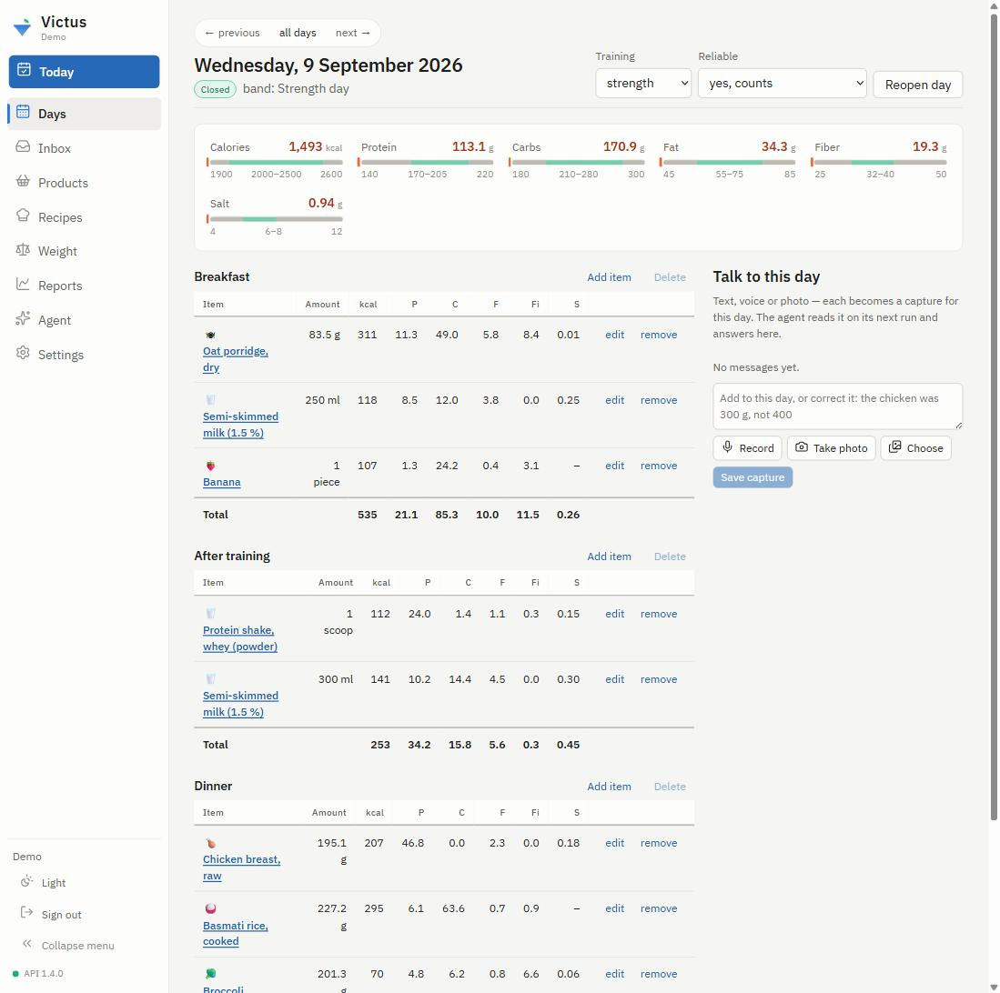
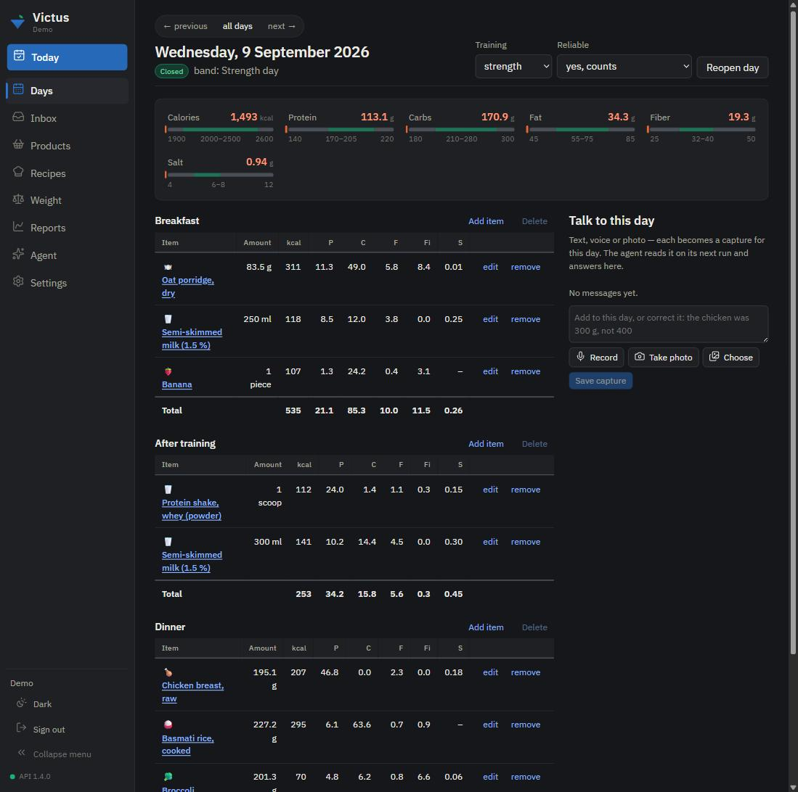
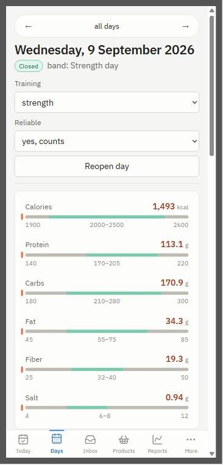
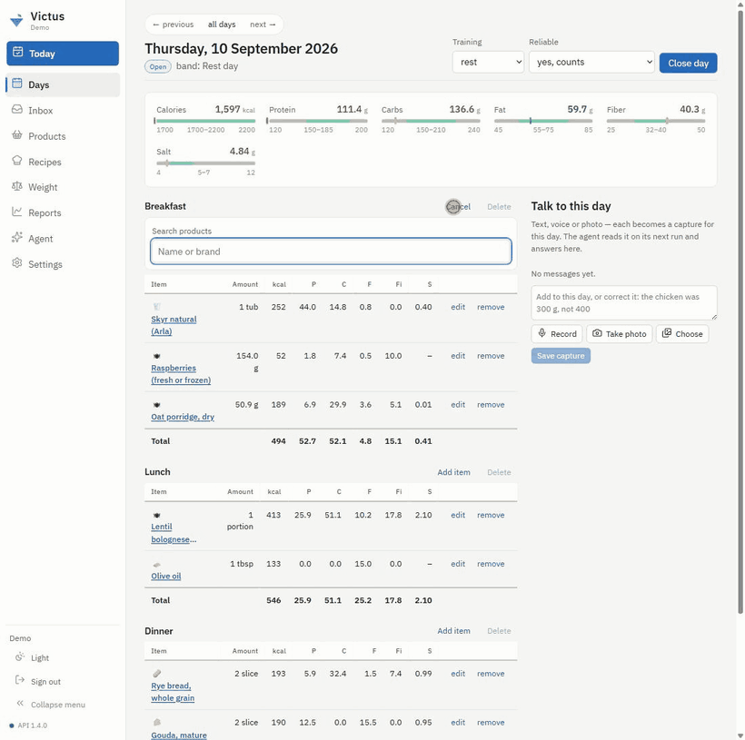
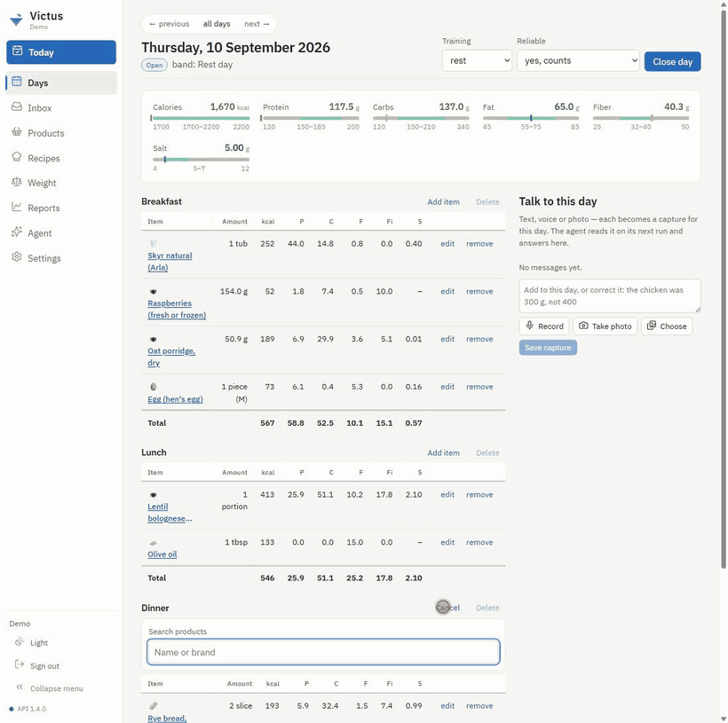
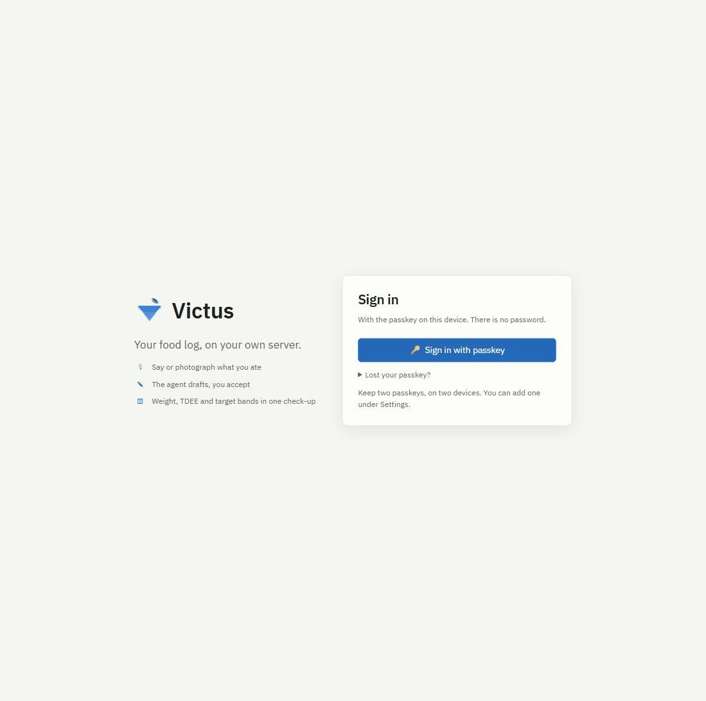
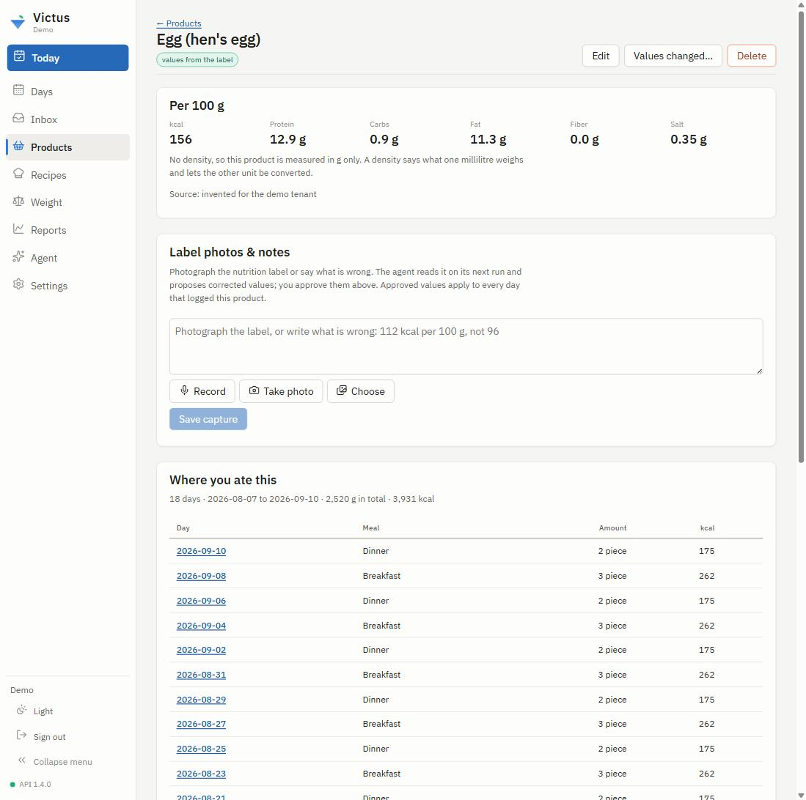
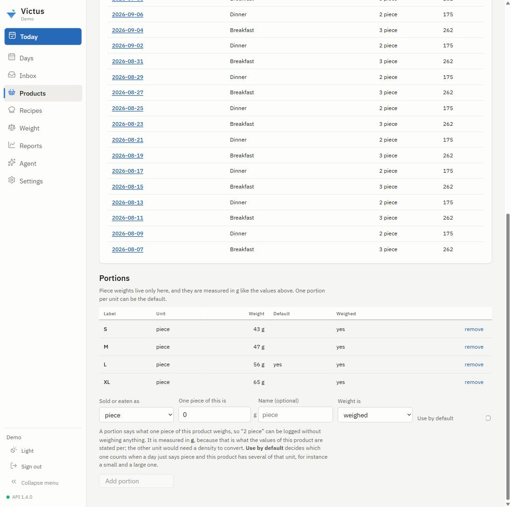
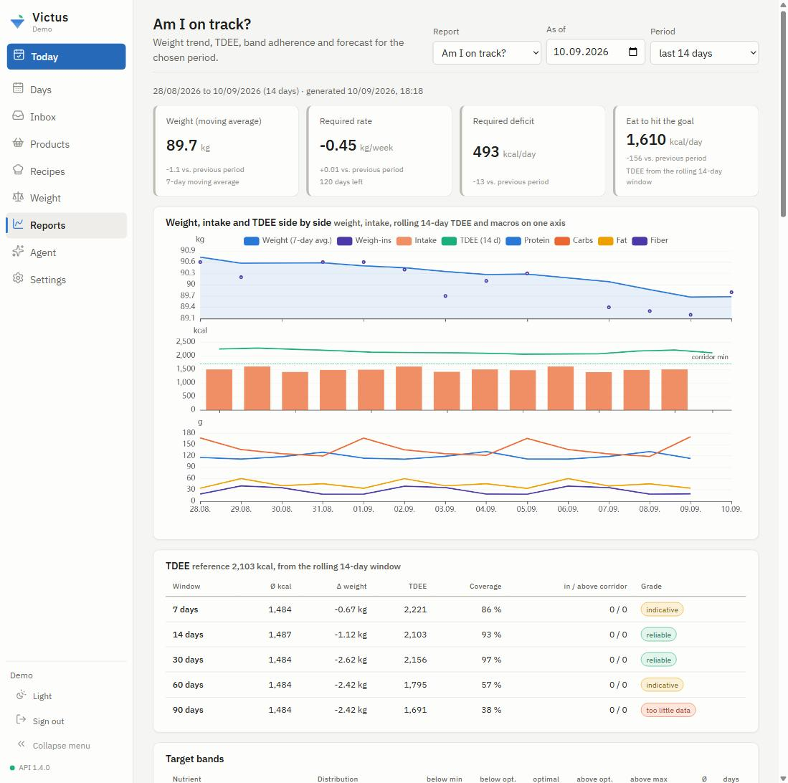
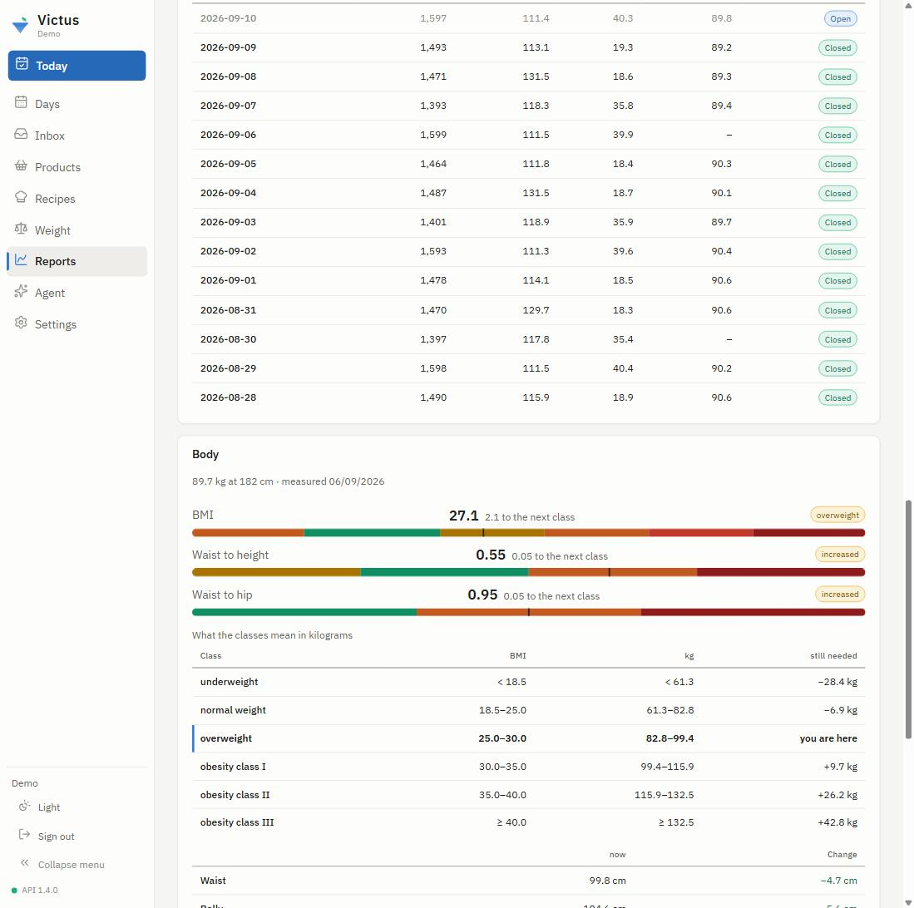

# Showcase

A tour of the web app, one screen at a time. Every picture comes from a demo tenant filled by
`scripts/demo_seed.py`: the food, the weights and the body measurements are invented, and no real
photograph or voice note is used. [`docs/media/README.md`](media/README.md) says how the set is
reproduced when the interface changes.

## The day

A day is the unit of work. The target bands sit above the meals, so the answer to "how am I
doing" is on the same screen as the food that answers it; each band shows the minimum, the
optimal range and the maximum for that day's training type, and the marker says where the day
stands. Nutrients are computed from the products the lines point to — a corrected label fixes
every day that used it — while the amounts are frozen at the moment of logging.

The thread on the right is how the day talks back. Text, a voice note or a photograph each
become a capture; the agent reads them on its next run and answers here.

The same day in the dark scheme, which follows the operating system unless you pick one:

And at phone width, where the rail becomes a bottom bar and the thread moves below the meals:

## Logging an item

Search a product, give the amount, pick the unit — the item lands and the bands move with it.
Piece weights are portions on the product, so "1 piece (M)" is logged without weighing anything:

## The question a portion answers

A unit the product has no portion for is not refused and not guessed: the app asks once what
one of them weighs, saves it with the product, and the unit works from then on.

## The catalogue

Products carry nutrients per 100 g or 100 ml and nothing else — no per-portion nutrition, no
duplicate rows per size. The source column says where the numbers came from, which is the
difference between a label you photographed and a value somebody estimated.

A product page shows the values, whether a density exists (and what it would let you convert),
the label photos and notes still waiting for the agent, and every day this product was eaten:

Portions live only here, and only in the unit the product's nutrients are stated in. One per
unit can be the default, which decides what "2 piece" means when a day does not say which size:

## The check-up

"Am I on track?" is a report, not a hard-coded page: a YAML document rendered to JSON for the
web, Markdown for a chat, or SVG. Weight, intake, the rolling TDEE and the macros share one
time axis, and the TDEE table says how much each window can be trusted rather than printing a
single confident number.

The body block shows the classes in the unit a person can act on. A BMI of 27.1 means little on
its own, so the table also carries the kilograms each class begins at and how far away it is:

